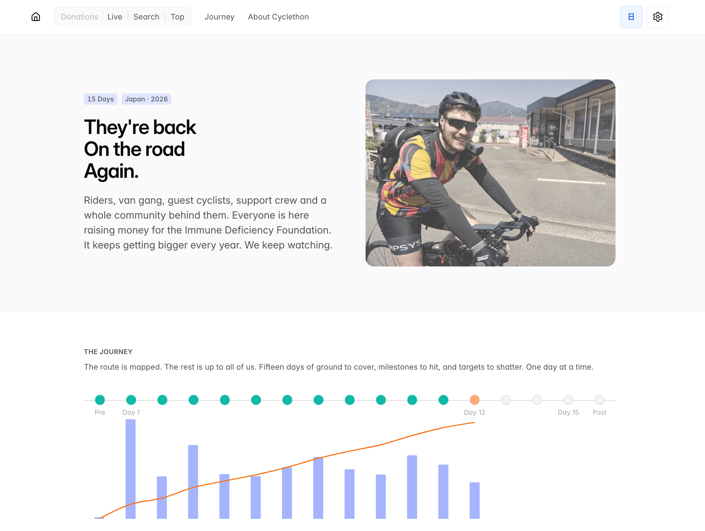

# CDawgVA Cyclethon Tracker

A real-time donation tracker built for the [CDawgVA Cyclethon 5](https://tiltify.com/@cdawgva/cyclethon-5) charity event, a 15-day cross-Japan cycling challenge. The app ingests live donation data via Tiltify webhooks and a Cloudflare R2 data feed, then presents it through multiple interactive views: live feed, donor leaderboards, searchable history, journey progress, and themed "donation wars."

Built with **Next.js 15**, **React 19**, **Chakra UI v3**, and **TypeScript**. Supports English and Japanese with timezone-aware formatting.

## Demo

**Live site:** [cdawgva-cyclethon.vercel.app](https://cdawgva-cyclethon.vercel.app/)



Key screens include:

- **Live Feed**: streaming donation table with relative timestamps
- **Top Donors**: ranked leaderboard by total donated and largest single donation
- **Search**: full history with text search, amount filtering, sorting, and pagination
- **Journey**: day-by-day route tracker with maps, daily stats, and embedded clips
- **Donation Wars**: real-time category tallies where donations are classified by theme (anime, games, countries, Pokemon, etc.) using regex pattern matching on donor comments

## Tech Stack

| Layer        | Technology                                            |
| ------------ | ----------------------------------------------------- |
| Framework    | Next.js 15 (App Router, Server Components, React 19)  |
| UI           | Chakra UI v3, Lucide Icons, Recharts                  |
| Language     | TypeScript 5.8 (strict mode)                          |
| Real-time    | Tiltify Webhooks (HMAC-SHA256) + Server-Sent Events   |
| Data         | Cloudflare R2 (public JSON bucket)                    |
| i18n         | Custom hook-based system (EN/JP), no external library |
| Hosting      | Vercel (auto-deploy on push to `main`)                |
| Code Quality | ESLint 9, Prettier, TypeScript strict                 |

## Architecture

```text
Browser  <--  SSE stream  ──  Next.js API route  <--  Tiltify webhook (HMAC verified)
   │                              │
   │                              ▼
   └──  polling (30s)  -->  Cloudflare R2 (JSON)  <--  external data pipeline
```

**Data flow:**

1. **Tiltify** sends donation events to `/api/webhooks/tiltify`, verified with HMAC-SHA256
2. Events are broadcast to connected clients via an in-memory **EventEmitter** singleton and **Server-Sent Events** (`/api/donations/stream`)
3. As a fallback, pages also **poll Cloudflare R2** every 30 seconds for the latest JSON snapshot
4. Server Components fetch data at request time with **60-second revalidation** for fast initial loads

**State and rendering:**

- Server Components handle initial data fetch (SSR with cache revalidation)
- A **DonationsContext** provider shares donation state across client components
- Three context providers manage user preferences: appearance (dark/light/system), locale (EN/JP), and timezone (JST/UTC/local), all persisted in localStorage

## Key Features

- **Real-time updates** via webhook-driven SSE with polling fallback
- **Donation war classifier**: regex pattern engine that categorizes donations into themed wars (anime, games, countries, pizza, Pokemon, Gacha, etc.) by parsing donor comments
- **Custom i18n**: lightweight hook-based translation system with namespace scoping, no external dependency
- **Multi-timezone support**: timestamps render in JST, UTC, or local time; currency symbols adapt accordingly
- **Animated counters**: donation totals animate smoothly using `requestAnimationFrame` with cubic ease-out
- **Responsive design**: mobile drawer navigation, adaptive chart sizing (30 bars mobile / 60 desktop)
- **Dark/light mode**: system-aware theming via next-themes + Chakra UI color mode

## What This Demonstrates

| Skill                     | Where it shows up                                                                      |
| ------------------------- | -------------------------------------------------------------------------------------- |
| **Frontend architecture** | Next.js App Router with server/client component split, context providers, custom hooks |
| **Real-time systems**     | Webhook ingestion, HMAC signature verification, SSE broadcasting, polling fallback     |
| **TypeScript**            | Strict mode, typed interfaces for all data, type-safe context/hooks                    |
| **API design**            | REST webhook endpoint, SSE streaming endpoint, structured error handling               |
| **State management**      | React Context for global state, localStorage persistence, animated transitions         |
| **i18n engineering**      | Custom translation system with namespace lookup, locale detection                      |
| **Data processing**       | Regex-based text classification, donation aggregation, multi-currency handling         |
| **UI/UX**                 | Responsive layouts, dark mode, timezone handling, loading states, search with filters  |
| **DevOps**                | Vercel CI/CD, Cloudflare R2 integration, environment-based configuration               |

## Getting Started

### Prerequisites

- Node.js 18+
- npm

### Installation

```bash
# Clone the repository
git clone https://github.com/rockacola/cdawgva-cyclethon-app.git
cd cdawgva-cyclethon-app

# Install dependencies
npm install

# Set up environment variables
cp .env.example .env.local
```

### Environment Variables

Edit `.env.local` with:

| Variable                     | Required | Description                                                                     |
| ---------------------------- | -------- | ------------------------------------------------------------------------------- |
| `NEXT_PUBLIC_R2_BASE_URL`    | Yes      | Base URL of the Cloudflare R2 public bucket serving donation JSON files         |
| `TILTIFY_WEBHOOK_SIGNING_ID` | No       | Secret for verifying Tiltify webhook signatures (not needed for local browsing) |

### Run

```bash
npm run dev          # Start dev server at http://localhost:3000
```

### Other Commands

```bash
npm run build        # Production build
npm start            # Start production server
npm run lint         # ESLint
npm run typecheck    # TypeScript type checking
npm run format       # Prettier (write)
npm run check        # Run format + lint + typecheck
```

## Project Structure

```text
src/
├── app/                  # Next.js App Router pages
│   ├── api/              # API routes (webhook handler, SSE stream)
│   ├── donations/        # Live, search, and top donor pages
│   ├── journey/          # Day-by-day journey pages ([day] dynamic route)
│   └── stats/            # Donation war tracker
├── components/           # React components (UI, charts, leaderboards)
├── contexts/             # DonationsContext (global donation state)
├── hooks/                # Custom hooks (polling, translations, animation)
├── lib/                  # Data fetching, types, utilities, pattern matchers
├── messages/             # Translation files (en.json, ja.json)
└── providers/            # Chakra, appearance, locale, timezone providers
```

## Future Improvements

- Add unit and integration tests for data processing and pattern matching logic
- Extract donation war patterns into a configurable format (JSON/YAML) for non-developer editing
- Add WebSocket support as an alternative to SSE for bidirectional communication
- Implement donation milestone notifications and achievement badges
- Add historical event comparison (Cyclethon 4 vs 5 stats)
